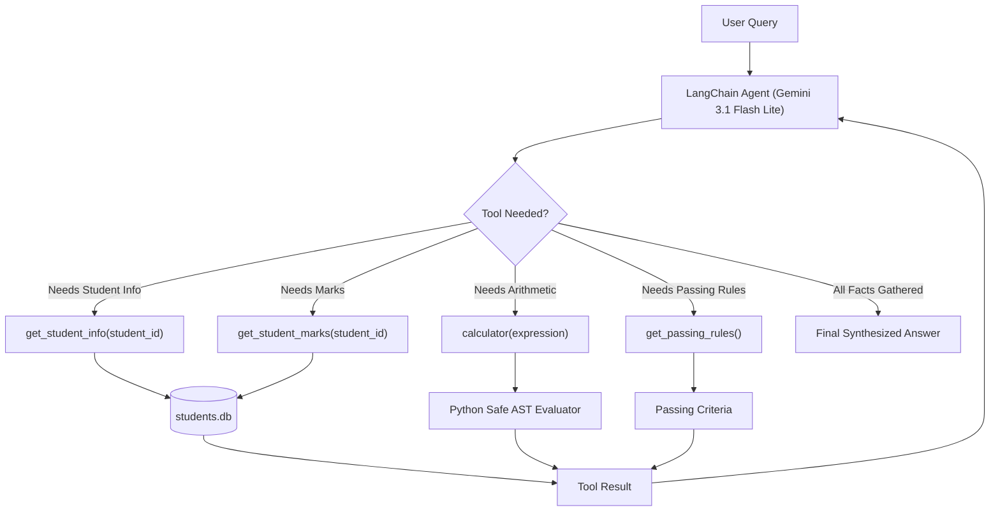

# 🎓 LangChain Student Academic Advisor Agent

[](https://www.python.org/)
[](https://www.langchain.com/)
[](https://ai.google.dev/)
[](https://www.sqlite.org/)

An **autonomous agentic workflow** built with **LangChain** and **Google Gemini** that dynamically queries student records from a local SQLite database (`students.db`), performs arithmetic calculations, and evaluates university passing rules without hardcoded pipelines.

---

## 📌 Problem Statement

Given a SQLite database containing student information and subject marks, build a LangChain agent powered by Google Gemini that can answer complex academic questions by autonomously selecting, invoking, and chaining the appropriate tools.

### 🗄️ Database: `students.db`

The database contains the `students` table populated with the following records:

| student_id | name | department | python | database | ai | web |
| :--- | :--- | :--- | :---: | :---: | :---: | :---: |
| **22CS045** | Dhanushya | Computer Science | 85 | 72 | 90 | 78 |
| **22CS046** | Rahul | Computer Science | 65 | 70 | 68 | 72 |
| **22CS047** | Priya | Information Technology | 92 | 88 | 95 | 90 |
| **22CS048** | Arun | Information Technology | 55 | 60 | 58 | 62 |
| **22CS049** | Meena | Computer Science | 78 | 85 | 80 | 88 |

---

## 🛠️ The 4 LangChain Tools

Each tool is implemented using LangChain's `@tool` decorator with strict type annotations and explicit docstrings:

| Tool | Signature | Return Value | Description |
| :--- | :--- | :--- | :--- |
| **`get_student_info`** | `(student_id: str)` | `dict` | Returns `name` and `department` for a student. |
| **`get_student_marks`** | `(student_id: str)` | `dict` | Returns marks in `python`, `database`, `ai`, and `web`. |
| **`calculator`** | `(expression: str)` | `str` | Safely evaluates math expressions (e.g. `85 + 72 + 90 + 78`, `325 / 4`). |
| **`get_passing_rules`** | `()` | `dict` | Returns university criteria: Min mark per subject $\ge 35$, Min overall average $\ge 40\%$. |

---

## 🧠 Autonomous Agent Architecture

Instead of hardcoding a fixed pipeline (`info -> marks -> calc`), the LLM acts as the decision-maker in an iterative reasoning loop:



---

## 🔍 Verified Query Test Traces

### 1. Question 1: Name and Department
> **Query**: *"What is the name and department of student 22CS045?"*
* **Tool Invocation**: `get_student_info({"student_id": "22CS045"})`
* **Output**:
  > The student with ID 22CS045 is **Dhanushya**, and she is in the **Computer Science** department.

### 2. Question 2: Student Marks
> **Query**: *"What are the marks of 22CS047?"*
* **Tool Invocation**: `get_student_marks({"student_id": "22CS047"})`
* **Output**:
  > The marks for student 22CS047 are: **Python: 92, Database: 88, AI: 95, Web: 90**.

### 3. Question 3: Total and Average
> **Query**: *"What is the total and average mark of 22CS045?"*
* **Tool Chain**:
  1. `get_student_marks({"student_id": "22CS045"})` $\rightarrow$ marks: 85, 72, 90, 78
  2. `calculator({"expression": "85 + 72 + 90 + 78"})` $\rightarrow$ `325`
  3. `calculator({"expression": "325 / 4"})` $\rightarrow$ `81.25`
* **Output**:
  > For student 22CS045, the total mark is **325** and the average mark is **81.25**.

### 4. Question 4: Passing Eligibility
> **Query**: *"Is 22CS045 eligible to pass according to the university rules?"*
* **Tool Chain**:
  1. `get_student_marks({"student_id": "22CS045"})`
  2. `get_passing_rules()`
  3. `calculator({"expression": "(85 + 72 + 90 + 78) / 4"})` $\rightarrow$ `81.25`
* **Output**:
  > **Yes, student 22CS045 is eligible to pass.**
  > All individual subject marks (85, 72, 90, 78) exceed the minimum threshold of 35, and the overall average of 81.25% exceeds the required 40%.

### 🏆 5. Challenge Question: Multi-Tool Autonomous Chaining
> **Query**: *"I am 22CS045. Tell me my name, department, total marks, average marks, and whether I satisfy the university passing requirements."*
* **Autonomous Tool Flow**:
  1. `get_student_info` $\rightarrow$ Dhanushya, Computer Science
  2. `get_student_marks` $\rightarrow$ 85, 72, 90, 78
  3. `get_passing_rules` $\rightarrow$ Min mark: 35, Min average: 40%
  4. `calculator("85 + 72 + 90 + 78")` $\rightarrow$ 325
  5. `calculator("325 / 4")` $\rightarrow$ 81.25
* **Synthesized Report**:
  > **Hello Dhanushya, here is your academic summary:**
  > - **Name:** Dhanushya
  > - **Department:** Computer Science
  > - **Subject Marks:** Python: 85, Database: 72, AI: 90, Web: 78
  > - **Total Marks:** 325
  > - **Average Marks:** 81.25%
  >
  > **Passing Status:**
  > Yes, you satisfy the university passing requirements. You have achieved an overall average of 81.25% (above 40%) and all your individual subject marks are well above the minimum passing mark of 35.

---

## ⚡ Performance Optimization

* **Model Choice**: Configured to use **`gemini-3.1-flash-lite`** (15 RPM limit), avoiding the lower 5 RPM rate limits of standard Flash models.
* **Windows IPv4 Acceleration**: Python on Windows defaults to IPv6, which can incur 20-second TCP timeouts if unrouted. An IPv4 socket patch is integrated into the script and notebook, dropping connection latency from **2+ minutes to ~13 seconds**.

---

## 🚀 How to Run

### Option 1: In VS Code (Recommended)
1. Clone the repository and open it in VS Code:
   ```bash
   git clone https://github.com/Prajeeth-12/sodak-day-5.git
   cd sodak-day-5
   ```
2. Create and activate virtual environment:
   ```bash
   python -m venv .venv
   .venv\Scripts\activate
   pip install -r requirements.txt
   ```
3. Create `.env` file with your Gemini API key:
   ```bash
   echo GEMINI_API_KEY=your_key_here > .env
   ```
4. Open [`student_academic_agent.ipynb`](student_academic_agent.ipynb) in VS Code, select the `.venv` kernel, and run all cells!

### Option 2: In Terminal CLI
Run the standalone Python script:
```bash
python student_agent.py
```

### Option 3: In Google Colab
1. Upload [`student_academic_agent.ipynb`](student_academic_agent.ipynb) to [Google Colab](https://colab.research.google.com/).
2. In Colab's left sidebar, click the **Secrets** icon (🔑) and add `GEMINI_API_KEY`.
3. Click **Runtime** > **Run all**.

---

## 📂 Project Structure

```text
sodak-day-5/
├── .env.example                 # Environment variables template
├── .gitignore                   # Ignores .env, .venv, and students.db
├── README.md                    # Project documentation & execution traces
├── init_db.py                   # SQLite database initialization & seeding
├── requirements.txt             # Project dependencies
├── student_academic_agent.ipynb # Interactive notebook with saved outputs
└── student_agent.py             # Standalone Python script runner
```

---

## 📜 License
MIT License
