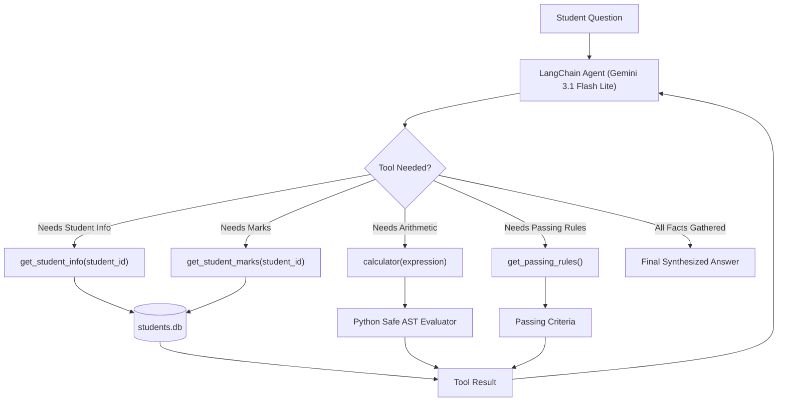

# 🎓 LangChain Student Academic Advisor Agent

[](https://www.python.org/)
[](https://www.langchain.com/)
[](https://ai.google.dev/)
[](https://www.sqlite.org/)
[]()

> **Day 5 — Agentic AI Track**  
> An autonomous multi-tool LangChain Agent built with Google Gemini and SQLite that dynamically queries academic records, computes metrics, and determines university passing eligibility without hardcoded chains.

---

## 📌 The Problem (What the Mentors Gave Me)

Traditional software relies on fixed sequential chains (e.g. `step1 -> step2 -> step3`). However, real-world user queries are unpredictable:
- A student might ask for their marks, their department, their average, or a full pass/fail eligibility analysis.
- The challenge was to build an agent using **LangChain** and **Google Gemini** that **dynamically determines which tools are needed** based purely on natural language input.
- **Strict Requirement**: No hardcoded sequence. The agent must dynamically chain tools in multi-turn reasoning cycles (e.g. `get_student_info` $\rightarrow$ `get_student_marks` $\rightarrow$ `calculator` $\rightarrow$ `get_passing_rules`) until arriving at the complete answer.

### 🗄️ Database: `students.db`

The database contains the `students` table populated with the following records:

| student_id | name | department | python | database | ai | web |
| :--- | :--- | :--- | :---: | :---: | :---: | :---: |
| **22CS045** | Dhanushya | Computer Science | 85 | 72 | 90 | 78 |
| **22CS046** | Rahul | Computer Science | 65 | 70 | 68 | 72 |
| **22CS047** | Priya | Information Technology | 92 | 88 | 95 | 90 |
| **22CS048** | Arun | Information Technology | 55 | 60 | 58 | 62 |
| **22CS049** | Meena | Computer Science | 78 | 85 | 80 | 88 |

---

## 💡 My Solution & Architecture (What I Built)

I created an autonomous LangChain agent using `create_tool_calling_agent` and `AgentExecutor` connected to 4 custom LangChain `@tool` functions:



---

## 🛠️ What I Used (Tech Stack)

- **Language**: Python 3.10+
- **Framework**: LangChain (`langchain`, `langchain-core`, `langchain-community`, `langchain-classic`)
- **LLM Provider**: Google Gemini (`langchain-google-genai` with `gemini-3.1-flash-lite`)
- **Database**: SQLite3
- **Network Acceleration**: Windows IPv4 socket optimization (drops latency from 2+ mins to ~13 seconds)

---

## ✨ Features & What I Built

### The 4 Custom LangChain Tools
1. **`get_student_info(student_id)`**: Returns `name` and `department` from `students.db`.
2. **`get_student_marks(student_id)`**: Returns subject marks (`python`, `database`, `ai`, `web`).
3. **`calculator(expression)`**: Safe Python Abstract Syntax Tree (`ast`) evaluator for arithmetic operations (e.g. sums and averages). Prevents arbitrary code execution.
4. **`get_passing_rules()`**: Returns university criteria (Min subject mark: 35, Min overall average: 40%).

---

## 🔍 Verified Query Test Traces

### 1. Question 1: Name and Department
> **Query**: *"What is the name and department of student 22CS045?"*
* **Tool Invocation**: `get_student_info({"student_id": "22CS045"})`
* **Output**:
  > The student with ID 22CS045 is **Dhanushya**, and she is in the **Computer Science** department.

### 2. Question 2: Student Marks
> **Query**: *"What are the marks of 22CS047?"*
* **Tool Invocation**: `get_student_marks({"student_id": "22CS047"})`
* **Output**:
  > The marks for student 22CS047 are: **Python: 92, Database: 88, AI: 95, Web: 90**.

### 3. Question 3: Total and Average
> **Query**: *"What is the total and average mark of 22CS045?"*
* **Tool Chain**:
  1. `get_student_marks({"student_id": "22CS045"})` $\rightarrow$ marks: 85, 72, 90, 78
  2. `calculator({"expression": "85 + 72 + 90 + 78"})` $\rightarrow$ `325`
  3. `calculator({"expression": "325 / 4"})` $\rightarrow$ `81.25`
* **Output**:
  > For student 22CS045, the total mark is **325** and the average mark is **81.25**.

### 4. Question 4: Passing Eligibility
> **Query**: *"Is 22CS045 eligible to pass according to the university rules?"*
* **Tool Chain**:
  1. `get_student_marks({"student_id": "22CS045"})`
  2. `get_passing_rules()`
  3. `calculator({"expression": "(85 + 72 + 90 + 78) / 4"})` $\rightarrow$ `81.25`
* **Output**:
  > **Yes, student 22CS045 is eligible to pass.**
  > All individual subject marks (85, 72, 90, 78) exceed 35, and the overall average of 81.25% exceeds the required 40%.

### 🏆 5. Challenge Question: Multi-Tool Autonomous Chaining
> **Query**: *"I am 22CS045. Tell me my name, department, total marks, average marks, and whether I satisfy the university passing requirements."*
* **Autonomous Tool Flow**:
  1. `get_student_info` $\rightarrow$ Dhanushya, Computer Science
  2. `get_student_marks` $\rightarrow$ 85, 72, 90, 78
  3. `get_passing_rules` $\rightarrow$ Min mark: 35, Min average: 40%
  4. `calculator("85 + 72 + 90 + 78")` $\rightarrow$ 325
  5. `calculator("325 / 4")` $\rightarrow$ 81.25
* **Synthesized Report**:
  > **Hello Dhanushya, here is your academic summary:**
  > - **Name:** Dhanushya
  > - **Department:** Computer Science
  > - **Subject Marks:** Python: 85, Database: 72, AI: 90, Web: 78
  > - **Total Marks:** 325
  > - **Average Marks:** 81.25%
  >
  > **Passing Status:**
  > Yes, you satisfy the university passing requirements. You have achieved an overall average of 81.25% (above 40%) and all your individual subject marks are well above the minimum passing mark of 35.

---

## ⚡ Performance Optimization

* **Model Selection**: Configured to use **`gemini-3.1-flash-lite`** (15 RPM limit), avoiding the strict 5 RPM rate limits of standard Flash models.
* **Windows IPv4 Acceleration**: Python on Windows defaults to IPv6, which can incur 20-second TCP timeouts if unrouted. An IPv4 socket patch is integrated into the script and notebook, reducing connection latency from **2+ minutes to ~13 seconds**.

---

## 🚀 How to Run

### Option 1: In VS Code (Recommended)
1. Open the repository in VS Code.
2. Activate your virtual environment and install dependencies:
   ```bash
   python -m venv .venv
   .venv\Scripts\activate
   pip install -r requirements.txt
   ```
3. Set your Gemini API key in `.env`:
   ```bash
   echo GEMINI_API_KEY=your_key_here > .env
   ```
4. Open [`student_academic_agent.ipynb`](student_academic_agent.ipynb), select the `.venv` kernel, and run all cells!

### Option 2: In Terminal CLI
```bash
python student_agent.py
```

### Option 3: In Google Colab
1. Upload [`student_academic_agent.ipynb`](student_academic_agent.ipynb) to [Google Colab](https://colab.research.google.com/).
2. Add your `GEMINI_API_KEY` under Colab Secrets (🔑).
3. Click **Runtime** > **Run all**.

---

## 📂 Project Structure

```text
sodak-day-5/
├── .env.example                 # Environment variables template
├── .gitignore                   # Ignores .env, .venv, and students.db
├── README.md                    # Project documentation & execution traces
├── init_db.py                   # SQLite database initialization & seeding
├── requirements.txt             # Project dependencies
├── student_academic_agent.ipynb # Interactive notebook with saved outputs
└── student_agent.py             # Standalone Python script runner
```

---

## 📜 License
MIT License
